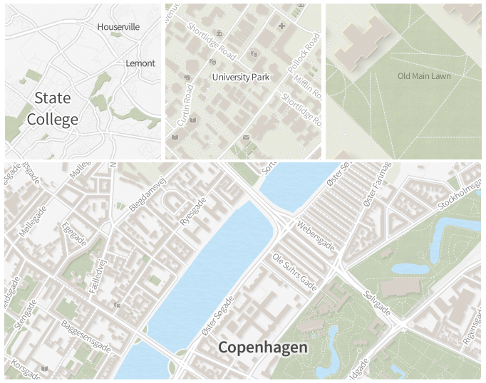

# Vetiver, a fresh style for TileMill2

Vetiver is a clean, fresh map style emphasizing tasteful textures, natural building shadows and the soft, warm glow of the sun. 

It was originally designed as a campus map of the Pennsylvania State University for the [BDSS homepage](http://www.bdss.psu.edu).

## Things that need doing:

* Adjust street styles to add a recessed appearance
* ~~Give water a soft texture, north-west bevel~~
* Set type in a more distinct typeface + tweak street label repetitions
* Standardize appearance across scale
* Broaden use for general, large scale reference mapping
